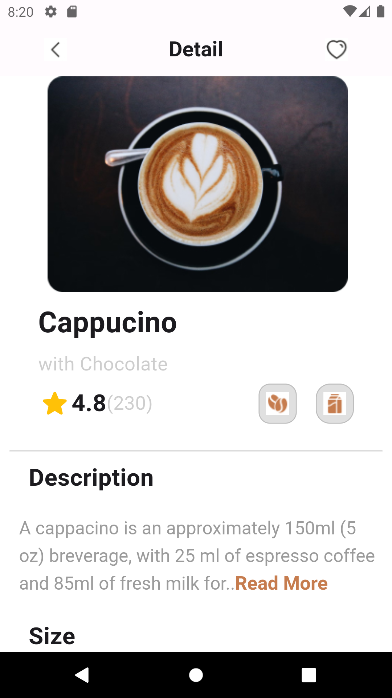
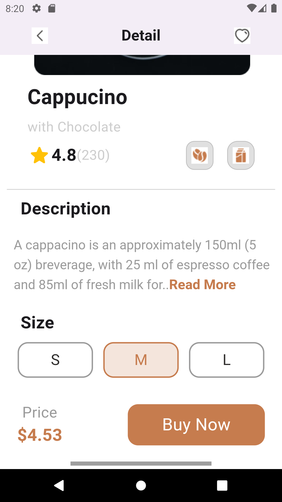

# Cappuccino App Project Description

## Project Overview

The Cappuccino App Project is a Flutter-based mobile application designed to present a landing page for a product called "Cappuccino." The project was crafted using the Google Pixel 2 Android Studio Emulator for development and testing.

## Code Structure

- **Main.dart**:
  The `main.dart` file serves as the entry point for the Capuccino App project, initializing MaterialApp and defining its theme.

- **Home Class**: Defines the main screen of the application. It consists of an AppBar with navigation icons and a title. The body contains several sections such as HeroSection, DescriptionSection, and PaymentSection.

- **HeroSection Class**: Displays essential information about the Cappuccino product, such as an image, product name, type, rating, sales, and icons.

- **DescriptionSection Class**: Provides a detailed description of the Cappuccino product along with a "Read More" option and displays different size options for the product.

- **PaymentSection Class**: Displays the price of the Cappuccino product and a "Buy Now" button.

## Components

- **AppBar**: Customized AppBar with navigation icons and a title.
- **Images**: Images of the Cappuccino product displayed in various sections.
- **Texts**: Product names, types, ratings, sales, descriptions, and size options.
- **Buttons**: Buttons for selecting different product sizes and for purchasing the product.

## Emulator Used

The Capuccino App Project was developed and tested using the Google Pixel 7 Android Studio Emulator.
